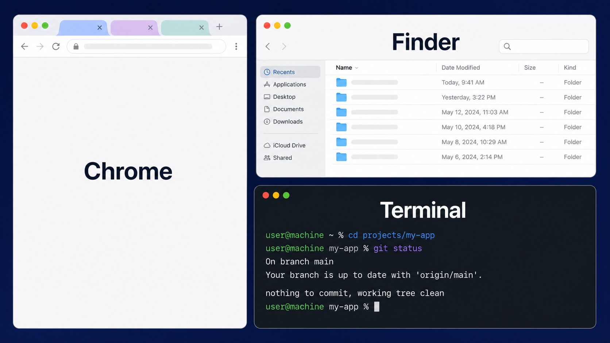

# PitaMado

PitaMado is a lightweight macOS menu-bar window manager for keyboard-and-mouse workflows. It moves and resizes ordinary application windows through the macOS Accessibility API, without adding a Dock icon.

> This is an early-stage personal project. It is useful for local workflows, but is not a notarized or sandboxed distribution.

## Features

- Move the frontmost window to the left half, right half, center, or maximum size.
- Tile visible windows on the current screen.
- Put terminal applications below other windows.
- Apply a favorite layout for Chrome-family browsers, Finder, and terminal applications.
- Avoid moving windows from another macOS Space, and never create missing windows for a favorite layout.

### Favorite layout

The current screen is split into a left third and a right two-thirds:



- Chrome-family browser: left third, full height
- Finder: upper-right half; two Finder windows use 20% and 46% of the full screen width (approximately 30:70 within the right side)
- Terminal: lower-right half; two terminal windows split evenly

PitaMado recognizes Google Chrome, Edge, Brave, Vivaldi, and Arc as Chrome-family browsers. Terminal, iTerm2, Warp, Ghostty, Hyper, and WezTerm are recognized as terminal applications.

## Requirements

- macOS 13 or later
- Accessibility permission for PitaMado
- Swift compiler (or Xcode) to build from source

## Build and run

```sh
git clone https://github.com/ohta-keiichi/PitaMado.git
cd PitaMado
./build-local.sh
open build/PitaMado.app
```

`build-local.sh` signs with a local certificate named `PitaMado Local Code Signing` when it is available. Otherwise, it uses ad-hoc signing. Reusing one local signing certificate helps macOS retain the Accessibility permission across rebuilds.

To build in Xcode, open `PitaMado.xcodeproj` and run the `PitaMado` scheme.

## Accessibility permission

PitaMado needs permission before it can reposition windows:

`System Settings > Privacy & Security > Accessibility > PitaMado`

If the permission was granted before changing signing identities, quit and reopen the app after granting it again.

## Privacy

PitaMado operates locally through macOS Accessibility APIs. It does not include analytics, networking, or a server component.

## Project structure

- `PitaMado/` — Swift source and app resources
- `PitaMado.xcodeproj/` — Xcode project
- `build-local.sh` — reproducible local build and signing script
- `アプリ概要.md` — Japanese product notes

## License

Released under the [MIT License](LICENSE).
